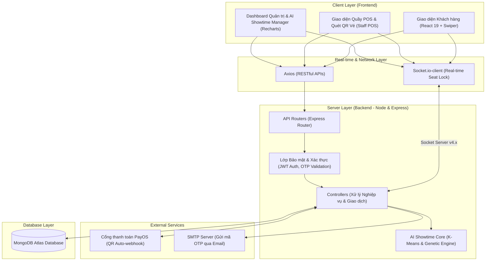
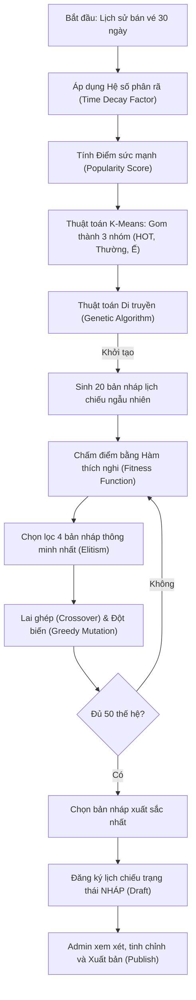

# 🎬 Cinema Lux - Hệ thống Quản lý Rạp Chiếu Phim Tích Hợp AI & Real-time

**Cinema Lux** là một hệ thống quản lý rạp chiếu phim toàn diện (Full-stack MERN), được thiết kế để tối ưu hóa toàn bộ quy trình vận hành của một rạp chiếu phim hiện đại. Điểm đột phá lớn nhất của dự án là **Hệ thống Trí tuệ Nhân tạo (AI) tự động lập lịch chiếu** thông minh kết hợp thuật toán Phân cụm Máy học (K-Means), Thuật toán Di truyền (Genetic Algorithm), Thuật toán Tham lam (Greedy) và Hệ số Phao rã Thời gian (Time Decay Factor). Hệ thống cũng tích hợp công nghệ **Giao dịch thời gian thực (Real-time Transaction Lock)** thông qua WebSockets và **Cổng thanh toán tự động qua mã QR** (PayOS).

---

## 📐 Kiến trúc dự án (Project Architecture)

Hệ thống tuân thủ kiến trúc phân tầng chuẩn công nghiệp, tách biệt rõ ràng giữa các lớp xử lý dữ liệu, logic nghiệp vụ và giao diện người dùng.



### 1. Kiến trúc Backend (MVC Hybrid)
*   **Lớp Models (Database):** Định nghĩa cấu trúc dữ liệu chặt chẽ qua Mongoose Schema (`User`, `Movie`, `Room`, `Showtime`, `Booking`, `Snack`, `Voucher`, `Review`).
*   **Lớp Controllers (Business Logic):** Chứa toán bộ logic nghiệp vụ, quản lý trạng thái giữ ghế, xử lý giao dịch tài chính, kết hợp với Socket.io để cập nhật trạng thái ngay lập tức.
*   **Lớp Routes:** Phân định rõ nhóm API công khai (Public API) và API cần bảo mật (Protected API).
*   **Lớp Middleware:** Kiểm soát quyền hạn (Role-based Authorization), giải mã JSON Web Token (JWT) và bảo mật luồng API.
*   **Lớp AI Engine (scheduleAI.js):** Lõi xử lý độc lập nhận đầu vào từ Database để thực hiện tính toán tiến hóa lịch chiếu.

### 2. Kiến trúc Frontend (React 19 & Component-Driven SPA)
*   **Lớp Pages:** Chia cụm theo chức năng của từng Actor (`Admin`, `Staff`, `Customer`).
*   **Lớp Components:** Các thành phần UI có thể tái sử dụng cao (SeatMapGrid, SnackSelector, QRCodeScanner, v.v.).
*   **Lớp Router:** Quản lý điều hướng động và bảo vệ tuyến đường (Protected Routes) thông qua phân quyền người dùng.

---

## 🚀 Công nghệ sử dụng (Technology Stack)

### 1. Backend & AI Core
*   **Node.js & Express.js (v5.x):** Framework backend hiệu năng cao, xây dựng API RESTful tốc độ nhanh.
*   **MongoDB & Mongoose (v9.x):** Cơ sở dữ liệu NoSQL hướng tài liệu linh hoạt, hỗ trợ truy vấn quan hệ phức tạp qua `.populate()`.
*   **Socket.io (v4.x):** Kết nối WebSockets hai chiều thời gian thực (duy trì phiên giữ ghế, đồng bộ QR PayOS).
*   **Nodemailer:** Tự động gửi Email chứa mã xác thực OTP dùng để khôi phục mật khẩu.
*   **PayOS SDK Node:** Tích hợp sâu cổng thanh toán thế hệ mới, tự động tạo link thanh toán chứa QR code động.

### 2. Frontend
*   **React (v19):** Thư viện UI mới nhất, tối ưu hóa cơ chế render và quản lý State.
*   **Vite (v8.x):** Công cụ build frontend siêu tốc thay thế cho CRA lỗi thời, rút ngắn thời gian hot-reload.
*   **React Router Dom (v7):** Hệ thống định tuyến mạnh mẽ điều khiển phân quyền người dùng trực quan.
*   **Recharts:** Thư viện vẽ biểu đồ tương tác cao để trực quan hóa doanh thu, top phim trong trang Admin.
*   **Swiper.js:** Tạo các slide băng chuyền phim mượt mà trên cả máy tính lẫn thiết bị di động.
*   **Html5-qrcode:** Cho phép camera thiết bị quét trực tiếp mã QR Code của vé tại quầy (dành cho Nhân viên).

---

## 👥 Hệ thống Đối Tượng Sử Dụng (Actors & Permissions)

Dự án phân cấp rõ ràng 3 phân hệ đối tượng chính, mỗi đối tượng có một luồng giao diện và quyền truy cập API hoàn toàn riêng biệt:

| Actor | Quyền truy cập giao diện | Các tính năng cốt lõi được thực hiện |
| :--- | :--- | :--- |
| **Khách hàng** *(Customer)* | Giao diện Web đặt vé trực tuyến | - Xem danh sách phim đang chiếu, sắp chiếu, đánh giá và phản hồi phim.<br>- Xem chi tiết phim, đặt vé trực tuyến, chọn phòng chiếu/giờ chiếu.<br>- Giữ ghế thời gian thực (5 phút) và thanh toán tự động qua quét mã QR PayOS.<br>- Sử dụng mã giảm giá (Vouchers) và tích điểm thăng hạng thành viên (Thường / VIP).<br>- Tra cứu lịch sử đặt vé cá nhân và nhận vé điện tử kèm mã QR Code. |
| **Nhân viên** *(Staff)* | Giao diện Quầy bán vé POS & Check-in | - **Staff POS booking:** Bán vé và combo bắp nước trực tiếp tại quầy cho khách vãng lai.<br>- **Đồng bộ hóa ghế ngồi:** Chọn ghế thời gian thực đồng bộ trực tiếp với khách đặt online.<br>- **Ticket Check-in:** Sử dụng Camera điện thoại/Laptop để quét QR Code trên vé khách hàng để thực hiện kiểm vé (Check-in) nhanh chóng.<br>- Xem Dashboard doanh số bán hàng trong ngày của cá nhân. |
| **Quản trị viên** *(Admin)* | Dashboard Quản trị & Quản lý AI | - **AI Showtime Manager:** Trình quản lý lịch chiếu tối ưu bằng AI (Tạo lịch chiếu nháp tự động, duyệt xuất bản lịch chiếu, xóa lịch nháp).<br>- **Dashboard Analytics:** Xem thống kê doanh thu đa chiều qua biểu đồ trực quan.<br>- **Voucher & Campaign Engine:** Quản lý chiến dịch khuyến mại (phát hành voucher giảm giá).<br>- **CRUD System:** Quản lý toàn bộ thông tin Phim, Phòng chiếu (Seat Map), Combo đồ ăn, Thành viên rạp phim và phản hồi đánh giá. |

---

## 🧠 Các chức năng cốt lõi nổi bật (Core Features)

### 1. Hệ thống tự động xếp lịch chiếu AI (AI Smart Scheduling)
Đây là tính năng độc quyền và phức tạp nhất của hệ thống, giải quyết bài toán tối ưu hóa phòng chiếu mà các rạp lớn đang đau đầu:
*   **Time Decay Factor (Hệ số phân rã thời gian):** AI tự động đọc lịch sử giao dịch 30 ngày qua. Doanh thu của ngày hôm nay sẽ có trọng số cao nhất (x1.0), doanh thu càng cũ thì điểm số giảm dần (về x0.1). Điều này giúp AI nhạy bén nhận diện ra phim nào đang hạ nhiệt và phim nào đang đột phá phòng vé.
*   **K-Means Clustering:** Phân cụm toàn bộ phim đang hoạt động thành 3 nhóm khoa học: **Phim Cực HOT** (nhóm 0), **Phim Bình thường** (nhóm 1) và **Phim Ít khách/Ế** (nhóm 2).
*   **Genetic Algorithm (Thuật toán Di truyền):** 
    *   Tạo ra một quần thể ban đầu gồm 20 bản nháp lịch chiếu ngẫu nhiên.
    *   **Hàm Thích nghi (Fitness Function):** Đánh giá từng bản nháp dựa trên các tiêu chí thực tế: *Ưu tiên chiếu phim HOT vào giờ Vàng (17h-21h)*; *Trừ điểm nặng nếu xếp phim Ế chiếm giờ vàng hoặc phim trẻ em chiếu sau 10h đêm*; *Thưởng điểm nếu chiếu phim ma/kinh dị/18+ vào đêm muộn hoặc phim hoạt hình vào cuối tuần*.
    *   **Tiến hóa (Evolution):** Chạy qua 50 thế hệ lai ghép chéo (Crossover) và đột biến tự nhiên (Mutation - xóa trắng lịch một ngày của một phòng rồi dùng thuật toán Tham lam/Greedy để lấp kín tối ưu) để tìm ra lịch chiếu đem lại doanh thu cao nhất.
    *   Lịch chiếu AI sinh ra sẽ ở trạng thái **Nháp (Draft)** để Admin duyệt hoặc chỉnh sửa trước khi xuất bản lên trang chủ.



### 2. Giữ ghế thời gian thực (Real-time Seat Locking)
*   Sử dụng WebSockets để giải quyết triệt để tình trạng **Tranh chấp ghế** (2 người cùng thanh toán 1 ghế cùng lúc).
*   Khi người dùng hoặc nhân viên quầy click chọn ghế, hệ thống sẽ gửi tín hiệu khóa ghế lên server và broadcast lập tức đến tất cả người dùng khác đang xem cùng phòng chiếu đó. Ghế sẽ đổi sang màu vàng (đang được người khác chọn).
*   **Cơ chế Hủy tự động (Hold Timer):** Server sẽ tự động đếm ngược 5 phút. Nếu sau 5 phút người dùng không tiến hành thanh toán, Socket Server sẽ tự giải phóng ghế, hủy đếm ngược và cập nhật lại trạng thái ghế trống cho toàn hệ thống để tránh tình trạng "giữ ghế ảo".

### 3. Thanh toán QR Code tự động (PayOS Integration)
*   Thay vì nhập tay số tiền hoặc chuyển khoản thủ công chụp hóa đơn, hệ thống tạo ra một cổng thanh toán tự động bằng mã QR động chuẩn VietQR.
*   Khách hàng quét mã QR, số tiền và nội dung chuyển khoản được khóa cứng giúp giao dịch chính xác 100%.
*   Ngay khi ngân hàng nhận tiền, cổng PayOS sẽ bắn tín hiệu Webhook về Backend, Socket.io sẽ lập tức xác nhận giao dịch thành công trên giao diện của khách hàng chỉ sau 1-2 giây mà không cần khách hàng F5 trình duyệt.

### 4. Quét mã QR Check-in tại quầy
*   Sau khi mua vé thành công trực tuyến, khách hàng nhận được vé điện tử có mã QR độc nhất chứa chữ ký bảo mật.
*   Nhân viên soát vé chỉ cần bật camera trên giao diện Staff và quét mã QR của khách. Hệ thống tự động xác thực vé hợp lệ, cập nhật trạng thái "Đã sử dụng" trong cơ sở dữ liệu để ngăn ngừa gian lận hoặc tái sử dụng vé.

---

## 💡 Giải thích các công nghệ mới nổi & Đột phá trong dự án

Để bảo vệ đồ án xuất sắc và đạt điểm tuyệt đối trước Hội đồng chấm thi, dưới đây là định nghĩa và vai trò khoa học của các công nghệ được tích hợp trong dự án:

> [!NOTE]
> ### 1. Cổng thanh toán PayOS là gì?
> **PayOS** là cổng thanh toán mở thế hệ mới hỗ trợ tạo link thanh toán và quét mã QR tĩnh/động theo chuẩn VietQR của Napas. 
> *   *Điểm vượt trội:* Không cần phải có các thiết bị POS đắt tiền hay thủ tục tích hợp phức tạp với ngân hàng truyền thống. Nhờ cơ chế Webhook (tự động đẩy dữ liệu giao dịch về server), hệ thống của chúng ta có thể nhận biết giao dịch thành công ngay tức khắc để kích hoạt in vé hoặc giữ chỗ.
> *   *Lợi ích dự án:* Tự động hóa 100% quy trình đối soát giao dịch, loại bỏ rủi ro sai sót số tiền chuyển khoản của khách hàng.

> [!TIP]
> ### 2. WebSockets & Socket.io là gì?
> Giao thức HTTP truyền thống chỉ cho phép Client gửi yêu cầu và Server phản hồi (One-way). Đối với bài toán đặt ghế rạp phim, nếu 10 người cùng đặt vé mà dùng HTTP, họ phải liên tục F5 trang web để biết ghế nào đã bị mua.
> *   **Socket.io** là thư viện xây dựng trên giao thức **WebSockets**, cho phép thiết lập kết nối song phương (Two-way) liên tục và thời gian thực giữa Client và Server với độ trễ cực thấp (< 50ms).
> *   *Lợi ích dự án:* Giúp đồng bộ hóa ghế ngồi tức thời. Khách đặt online và nhân viên quầy POS nhìn thấy thay đổi của nhau ngay lập tức, ngăn chặn hoàn toàn hiện tượng trùng lặp đặt chỗ.

> [!IMPORTANT]
> ### 3. Thuật toán phân cụm K-Means (Machine Learning) là gì?
> **K-Means Clustering** là thuật toán Học không giám sát (Unsupervised Learning) dùng để gom nhóm các đối tượng vào $K$ cụm khác nhau dựa trên các thuộc tính đặc trưng (trong dự án này là điểm số doanh thu có trọng số thời gian).
> *   *Cơ chế hoạt động:* Thuật toán tự tìm ra các trọng tâm (centroids) của các cụm và phân bổ các bộ phim về cụm có khoảng cách khoảng chênh lệch điểm nhỏ nhất, sau đó cập nhật lại trọng tâm qua nhiều vòng lặp cho đến khi hội tụ.
> *   *Ý nghĩa dự án:* Đóng vai trò làm "bộ não" phân loại phim tự động thay thế hoàn toàn cho trực giác thủ công của quản lý rạp. Giúp rạp thích ứng tức thì với các cơn sốt phòng vé đột xuất.

> [!IMPORTANT]
> ### 4. Thuật toán Di truyền - Genetic Algorithm (GA) là gì?
> **Genetic Algorithm** là thuật toán tìm kiếm tối ưu hóa mô phỏng theo thuyết tiến hóa của Charles Darwin: Chọn lọc tự nhiên, Lai ghép và Đột biến.
> *   *Cơ chế hoạt động:* Biến các bản nháp lịch chiếu thành các "cá thể NST". Các cá thể tốt được giữ lại (Elitism), lai ghép với nhau (Crossover - trao đổi ca chiếu giữa các phòng) và thỉnh thoảng xảy ra đột biến (Mutation - thay đổi đột ngột toàn bộ lịch của 1 phòng) để thoát khỏi các tối ưu cục bộ. Qua nhiều thế hệ, chất lượng lịch chiếu sẽ tiến hóa vượt trội.
> *   *Ý nghĩa dự án:* Giải quyết bài toán NP-hard về lập lịch. Đảm bảo lịch chiếu được lấp đầy kín rạp mà vẫn tuân thủ các quy tắc logic nghiệp vụ ngặt nghèo nhằm tối đa hóa doanh thu.

---

## ⚙️ Hướng dẫn cài đặt và khởi chạy hệ thống

### 1. Yêu cầu môi trường cài đặt
*   **Node.js:** Phiên bản khuyến nghị v18.x hoặc cao hơn.
*   **MongoDB:** MongoDB Community Server (chạy cục bộ tại cổng mặc định `27017`) hoặc một tài khoản MongoDB Atlas Cloud.

---

### 2. Cài đặt và cấu hình Backend

1.  Mở terminal tại thư mục gốc dự án và di chuyển vào thư mục `backend`:
    ```powershell
    cd backend
    npm install
    ```
2.  Tạo file cấu hình môi trường `.env` nằm trong thư mục `backend/` với nội dung mẫu gợi ý như sau:
    ```env
    PORT=5000
    MONGO_URI=mongodb://127.0.0.1:27017/cinema_lux  # Hoặc đường dẫn MongoDB Atlas Cloud của bạn
    
    # Cấu hình bảo mật JWT (Chuỗi ký tự ngẫu nhiên bí mật để mã hóa token đăng nhập)
    JWT_SECRET=[YOUR_SECURE_JWT_SECRET_KEY]
    
    # Cấu hình kết nối cổng thanh toán PayOS (Lấy từ tài khoản đối tác merchant của PayOS)
    PAYOS_CLIENT_ID=[YOUR_PAYOS_CLIENT_ID]
    PAYOS_API_KEY=[YOUR_PAYOS_API_KEY]
    PAYOS_CHECKSUM_KEY=[YOUR_PAYOS_CHECKSUM_KEY]
    
    # Cấu hình gửi mail OTP bằng SMTP (Dùng tài khoản email và Mật khẩu ứng dụng)
    EMAIL_USER=[YOUR_EMAIL_ADDRESS]
    EMAIL_PASS=[YOUR_EMAIL_APP_PASSWORD]
    ```

> [!WARNING]
> *Lưu ý về bảo mật:* Tuyệt đối không để lộ các khóa bí mật của `PayOS` hay mật khẩu ứng dụng Gmail lên GitHub hoặc môi trường công khai. Bạn có thể đăng ký tài khoản PayOS Merchant miễn phí để lấy các khóa API ở chế độ Sandbox (Thử nghiệm) và điền vào file `.env`.

3.  Khởi động Server Backend:
    ```powershell
    npm start
    # Hoặc chạy ở chế độ phát triển (dev): npm run dev
    ```
    *Server Backend sẽ khởi chạy tại: `http://localhost:5000`*

---

### 3. 🛠 Công cụ khởi tạo dữ liệu mẫu cực kỳ mạnh mẽ (Seed Data)

Hệ thống tích hợp sẵn các công cụ giả lập dữ liệu cực kỳ mạnh mẽ để bạn chạy thử nghiệm toàn bộ hệ thống ngay lập tức mà không mất thời gian nhập tay hàng ngàn dòng dữ liệu:

*   **Tạo dữ liệu bán vé 7 ngày qua (Để test Doanh thu & Khởi động AI):**
    ```powershell
    node seedData.js
    ```
    *Script này sẽ tự động sinh hàng chục ngàn vé ngẫu nhiên trong vòng 7 ngày gần nhất, chấm điểm sức mạnh và in ra Top 3 bộ phim bán chạy nhất làm tư liệu ban đầu cho AI.*

*   **Kiểm tra tính thích ứng nhạy bén của AI K-Means:**
    ```powershell
    node seedTestAi.js
    ```
    *Script này sẽ bốc ngẫu nhiên 3 phim bất kỳ và "bơm" lượng lớn vé giả vào 2 ngày gần nhất để biến chúng thành siêu phẩm phòng vé ảo. Dùng để xem AI có nhạy bén nhận diện ra sự thay đổi và lập tức đẩy các phim này lên làm phim Cực HOT hay không.*

*   **Kiểm toán chấm điểm AI tự động (AI Auditor Evaluation):**
    ```powershell
    node evaluateAI.js
    ```
    *Chạy thử nghiệm lõi AI xếp lịch độc lập cho ngày mai và tiến hành đánh giá chi tiết xem lịch chiếu do AI sinh ra đạt được bao nhiêu điểm thích nghi, có vi phạm luật tuổi tác hay thời gian hay không.*

*   **Đào tạo trực tiếp mô hình AI hiện tại:**
    ```powershell
    node trainCurrentAI.js
    ```
    *Chạy tiến hóa mô hình ngay lập tức trên tập dữ liệu hiện thời để cập nhật phân cụm phim.*

---

### 4. Cài đặt và cấu hình Frontend

1.  Mở một terminal mới (song song với terminal chạy backend) và trỏ vào thư mục `frontend`:
    ```powershell
    cd frontend
    npm install
    ```
2.  Khởi động ứng dụng React trên máy chủ ảo Vite ở chế độ phát triển:
    ```powershell
    npm run dev
    ```
    *Giao diện Web Client sẽ chạy tại: `http://localhost:5173`*

3.  Đóng gói tối ưu hóa ứng dụng Frontend (Build Production):
    ```powershell
    npm run build
    ```
    *Thư mục `frontend/dist` chứa giao diện hoàn thiện đã được nén tối ưu sẽ được tự động tạo ra.*

---

### 4.5. 🌐 Cấu hình Ngrok để thử nghiệm Thanh toán PayOS (Local Testing Webhook)

Vì cổng thanh toán PayOS yêu cầu một đường dẫn công khai hỗ trợ **HTTPS (Webhook URL)** để gửi tín hiệu tự động xác nhận khi khách quét mã chuyển tiền thành công, khi chạy thử nghiệm trên máy cục bộ (localhost), bạn cần sử dụng **Ngrok** (Dự án đã tích hợp sẵn tệp `ngrok.exe` tại thư mục gốc `cinema/`):

1. Mở một terminal mới và trỏ thẳng vào thư mục gốc `cinema/` (nơi chứa file `ngrok.exe`):
   ```powershell
   # Chạy ngrok để mở cổng 5000 ra môi trường Internet
   ./ngrok http 5000
   ```
2. Ngrok sẽ tạo ra một đường dẫn HTTPS công khai tạm thời, ví dụ: `https://xxxx-xxx-xxx.ngrok-free.app`
3. Truy cập vào dashboard quản trị Merchant của PayOS và cấu hình đường dẫn **Webhook URL** của bạn bằng cách nối thêm API endpoint của server:
   ```text
   https://xxxx-xxx-xxx.ngrok-free.app/api/payment/payos-webhook
   ```
4. Khi khách quét mã QR thanh toán ảo thành công, PayOS sẽ gửi tín hiệu trực tuyến đi qua đường dẫn Ngrok này để tự động cập nhật trạng thái đặt vé của hệ thống ngay lập tức!

---

## 🌐 5. Hướng dẫn Triển khai & Chạy dự án trên Host/Server (Production Deployment)

Khi mang dự án lên máy chủ thật (VPS Linux như Ubuntu/CentOS, Heroku, Render...) để vận hành thực tế 24/7, hãy làm theo quy trình chuẩn sau:

### Bước 1: Build tối ưu hóa Frontend
Thay vì chạy server ảo hot-reload của Vite (chỉ dùng khi phát triển), bạn cần biên dịch mã nguồn React thành tệp tin tĩnh tối ưu hóa cao:
```bash
cd frontend
npm run build
```
Lệnh này sẽ tạo ra một thư mục `frontend/dist` chứa toàn bộ HTML, JS, CSS đã được nén và tối ưu hóa cực kỳ gọn nhẹ.

### Bước 2: Cơ chế phục vụ Static Files từ Backend
Backend trong file `server.js` của chúng ta đã được cấu hình sẵn để tự động phát hiện và phục vụ thư mục tĩnh `frontend/dist` này:
```javascript
app.use(express.static(path.join(__dirname, "../frontend/dist")));
app.use((req, res) => {
  res.sendFile(path.join(__dirname, "../frontend/dist/index.html"));
});
```
> [!TIP]
> Nhờ cơ chế này, khi triển khai thực tế trên Host, bạn **không cần phải chạy song song 2 port khác nhau**. Bạn chỉ cần chạy duy nhất Server Backend ở port `5000`, toàn bộ giao diện Frontend sẽ tự động được tải khi truy cập trực tiếp vào IP/Domain của Host.

### Bước 3: Cài đặt và Quản lý Tiến trình chạy ngầm bằng PM2
Để server NodeJS không bị tắt khi bạn tắt terminal, và tự động khởi động lại nếu bị lỗi hệ thống, hãy sử dụng **PM2 (Process Manager 2)**:
1. Cài đặt PM2 toàn cục trên Host:
   ```bash
   npm install -g pm2
   ```
2. Di chuyển vào thư mục `backend` và khởi chạy máy chủ:
   ```bash
   cd backend
   pm2 start server.js --name "cinema-lux-backend"
   ```
3. Các câu lệnh quản lý tiến trình hữu ích:
   * **Xem danh sách tiến trình:** `pm2 list` hoặc `pm2 status`
   * **Xem log hệ thống thời gian thực:** `pm2 logs`
   * **Dừng server:** `pm2 stop cinema-lux-backend`
   * **Khởi động lại server:** `pm2 restart cinema-lux-backend`
   * **Cài đặt tự khởi chạy khi reboot server:** `pm2 startup` rồi chạy `pm2 save`

### Bước 4: Cấu hình Nginx Reverse Proxy (Khuyên dùng)
Để bảo mật server, hỗ trợ chứng chỉ SSL (HTTPS) và trỏ tên miền (domain) về cổng `5000` của dự án, hãy sử dụng **Nginx**:
1. Cài đặt Nginx trên server Linux: `sudo apt update && sudo apt install nginx`
2. Tạo file cấu hình site mới: `sudo nano /etc/nginx/sites-available/cinema_lux`
3. Điền cấu hình Proxy mẫu như sau:
   ```nginx
   server {
       listen 80;
       server_name ten_mien_cua_ban.com; # Thay bằng tên miền thực tế của bạn

       # Cấu hình chuyển tiếp tất cả request về cổng 5000 của NodeJS
       location / {
           proxy_pass http://127.0.0.1:5000;
           proxy_http_version 1.1;
           proxy_set_header Upgrade $http_upgrade;
           proxy_set_header Connection 'upgrade';
           proxy_set_header Host $host;
           proxy_cache_bypass $http_upgrade;
           proxy_set_header X-Real-IP $remote_addr;
           proxy_set_header X-Forwarded-For $proxy_add_x_forwarded_for;
       }
   }
   ```
4. Kích hoạt cấu hình và restart Nginx:
   ```bash
   sudo ln -s /etc/nginx/sites-available/cinema_lux /etc/nginx/sites-enabled/
   sudo nginx -t
   sudo systemctl restart nginx
   ```

### Bước 5: Cấu hình Webhook PayOS trên Production
Khi chạy trên VPS với tên miền thực tế của bạn:
1. Đăng nhập vào trang quản trị Merchant của PayOS.
2. Cập nhật **Webhook URL** của bạn thành: `https://ten_mien_cua_ban.com/api/payment/payos-webhook`.
   *(Lưu ý: PayOS yêu cầu link Webhook bắt buộc phải sử dụng giao thức bảo mật HTTPS. Bạn có thể sử dụng Certbot Let's Encrypt miễn phí để cấp phát SSL nhanh chóng: `sudo apt install certbot python3-certbot-nginx && sudo certbot --nginx`).*

---

## 🔑 Danh sách tài khoản thử nghiệm hệ thống (Default Credentials)

Sau khi chạy thành công các tập lệnh khởi tạo dữ liệu (Seed Data), bạn có thể đăng nhập bằng các tài khoản kiểm thử mặc định sau:

1.  **Tài khoản Quản trị viên (Administrator):**
    *   **Email:** `admin@gmail.com`
    *   **Mật khẩu:** `123456`
    *   *Tính năng trải nghiệm:* Vào trang `/admin` hoặc click vào nút quản trị trên thanh Menu để duyệt lịch AI, quản lý phim, phòng chiếu, bắp nước, xem biểu đồ doanh thu.

2.  **Tài khoản Nhân viên (Staff / Cashier):**
    *   **Email:** `staff@gmail.com`
    *   **Mật khẩu:** `123456`
    *   *Tính năng trải nghiệm:* Đăng nhập xong sẽ tự động chuyển đến màn hình Quầy POS. Thực hiện bán vé trực tiếp cho khách, quét camera mã QR vé để check-in.

3.  **Tài khoản Khách hàng (Customer):**
    *   Bạn có thể đăng ký trực tiếp một tài khoản mới tinh ngay trên giao diện Web thông qua trang Đăng ký (Register) để trải nghiệm toàn bộ luồng mua vé, tích điểm thành viên, khôi phục mật khẩu qua email OTP vô cùng mượt mà.

---
Chúc bạn bảo vệ đồ án xuất sắc và đạt điểm tuyệt đối với dự án **Cinema Lux**! 🎉

