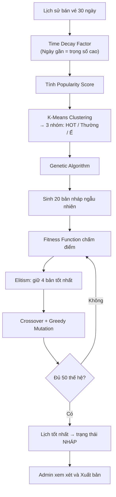

# Cinema Lux — Hệ thống Quản lý Rạp Chiếu Phim Tích hợp AI & Real-time

**Cinema Lux** là hệ thống quản lý rạp chiếu phim toàn diện được xây dựng theo kiến trúc **Full-stack MERN** (MongoDB, Express, React, Node.js). Điểm nổi bật của dự án là **Lõi AI tự động xếp lịch chiếu** kết hợp ba thuật toán: Phân cụm K-Means, Thuật toán Di truyền (Genetic Algorithm) và Thuật toán Tham lam (Greedy), cùng với **Đồng bộ ghế ngồi thời gian thực** qua WebSockets và **Thanh toán QR tự động** qua cổng PayOS.

---

## Cấu trúc thư mục dự án

```
cinema/
├── backend/                  # Node.js + Express Server
│   ├── ai/
│   │   └── scheduleAI.js     # Lõi AI: K-Means + Genetic Algorithm + Greedy
│   ├── config/
│   │   └── db.js             # Kết nối MongoDB
│   ├── controllers/          # Xử lý logic nghiệp vụ
│   │   ├── authController.js
│   │   ├── bookingController.js
│   │   ├── movieController.js
│   │   ├── paymentController.js
│   │   ├── reviewController.js
│   │   ├── showtimeController.js
│   │   ├── snackController.js
│   │   ├── userController.js
│   │   └── voucherController.js
│   ├── middleware/            # JWT Auth, Role-based Authorization
│   ├── models/               # Mongoose Schema
│   │   ├── Booking.js
│   │   ├── Movie.js
│   │   ├── ProfileDetail.js
│   │   ├── Review.js
│   │   ├── Room.js
│   │   ├── Showtime.js
│   │   ├── Snack.js
│   │   ├── User.js
│   │   └── Voucher.js
│   ├── routes/               # Express Router (10 nhóm API)
│   ├── uploads/              # Lưu ảnh upload (poster phim, snack)
│   ├── utils/                # Tiện ích dùng chung
│   ├── seedData.js           # Sinh dữ liệu bán vé 7 ngày qua
│   ├── seedTestAi.js         # Kiểm tra tính nhạy bén của AI
│   ├── trainCurrentAI.js     # Đào tạo lại AI ngay lập tức
│   ├── server.js             # Entry point: Express + Socket.io
│   └── .env                  # Biến môi trường (KHÔNG commit lên Git)
│
├── frontend/                 # React 19 + Vite SPA
│   └── src/
│       ├── api/              # Axios instance & API calls
│       ├── components/       # UI tái sử dụng (Navbar, Banner, SeatMap, Footer)
│       └── pages/
│           ├── Admin/        # Dashboard, MovieManager, ShowtimeManager, ...
│           ├── Staff/        # StaffBooking, StaffCheckin, StaffDashboard, ...
│           ├── Booking.jsx   # Luồng đặt vé + chọn ghế + thanh toán
│           ├── MovieDetail.jsx
│           ├── Profile.jsx
│           └── ...
│
└── ngrok.exe                 # Tool tạo HTTPS tunnel (test PayOS webhook)
```

---

### Backend — MVC Hybrid

| Lớp | Mô tả |
|---|---|
| **Models** | 9 Mongoose Schema: `User`, `Movie`, `Room`, `Showtime`, `Booking`, `Snack`, `Voucher`, `Review`, `ProfileDetail` |
| **Controllers** | Toàn bộ logic nghiệp vụ, quản lý trạng thái ghế, xử lý giao dịch tài chính |
| **Routes** | 10 nhóm API: `/api/auth`, `/api/movies`, `/api/rooms`, `/api/showtimes`, `/api/bookings`, `/api/payment`, `/api/snacks`, `/api/reviews`, `/api/vouchers`, `/api/users` |
| **Middleware** | Kiểm tra JWT, phân quyền Role (customer / staff / admin) |
| **AI Engine** | `ai/scheduleAI.js` — xử lý độc lập, nhận dữ liệu từ DB, sinh lịch nháp |

### Frontend — React 19 Component-Driven SPA

| Lớp | Mô tả |
|---|---|
| **Pages/Admin** | Dashboard, MovieManager, ShowtimeManager, RoomManager, SnackManager, VoucherManager, MemberManager, RevenueManager, ReviewManager |
| **Pages/Staff** | StaffBooking (POS), StaffCheckin (QR Scan), StaffDashboard, StaffMovies, StaffShowtimes |
| **Pages/Customer** | Booking (đặt vé), MovieDetail, Profile, TicketHistory, MembershipTab, VouchersTab, ForgotPassword |
| **Components** | Navbar, Banner (Swiper), SeatMap, Footer |

---

## Công nghệ sử dụng

### Backend
| Package | Phiên bản | Vai trò |
|---|---|---|
| `express` | ^5.2.1 | Framework REST API |
| `mongoose` | ^9.3.1 | ODM cho MongoDB |
| `socket.io` | ^4.8.3 | WebSockets real-time |
| `jsonwebtoken` | ^9.0.3 | Xác thực JWT |
| `bcrypt` | ^6.0.0 | Mã hóa mật khẩu |
| `@payos/node` | ^2.0.5 | Cổng thanh toán PayOS |
| `nodemailer` | ^8.0.7 | Gửi email OTP |
| `multer` | ^2.1.1 | Upload ảnh poster/snack |
| `dotenv` | ^17.3.1 | Biến môi trường |
| `moment` | ^2.30.1 | Xử lý ngày/giờ |

### Frontend
| Package | Phiên bản | Vai trò |
|---|---|---|
| `react` | ^19.2.4 | UI Library |
| `vite` | ^8.0.1 | Build tool |
| `react-router-dom` | ^7.13.1 | Routing & Protected Routes |
| `axios` | ^1.13.6 | HTTP Client |
| `socket.io-client` | ^4.8.3 | WebSocket Client |
| `recharts` | ^3.8.1 | Biểu đồ doanh thu |
| `swiper` | ^12.1.2 | Băng chuyền phim |
| `html5-qrcode` | ^2.3.8 | Quét QR code bằng camera |
| `react-icons` | ^5.6.0 | Bộ icon |

---

## Phân hệ người dùng (Actors)

| Actor | Giao diện | Tính năng chính |
|---|---|---|
| **Khách hàng** | Web đặt vé trực tuyến | Xem phim, đặt vé, chọn ghế real-time, thanh toán QR PayOS, dùng voucher, tích Lux Points, xem lịch sử vé, đánh giá phim |
| **Nhân viên** | Quầy POS & Check-in | Bán vé + combo tại quầy, đồng bộ ghế real-time với khách online, quét QR vé để check-in |
| **Quản trị viên** | Dashboard quản trị | Chạy AI xếp lịch, duyệt/xuất bản lịch nháp, CRUD phim/phòng/snack, quản lý voucher & khuyến mại, xem biểu đồ doanh thu, quản lý thành viên & đánh giá |

---

## Tính năng cốt lõi

### 1. AI Smart Scheduling — Tự động xếp lịch chiếu



- **Time Decay**: Doanh thu hôm nay = trọng số 1.0, càng cũ càng giảm về 0.1
- **K-Means**: Tự động phân loại phim → HOT / Bình thường / Ế
- **Genetic Algorithm**: 20 cá thể, 50 thế hệ tiến hóa, fitness function ưu tiên phim HOT vào giờ vàng (17h–21h)
- **Greedy Mutation**: Đột biến bằng cách lấp kín lịch một phòng theo thuật toán tham lam

### 2. Real-time Seat Locking — Giữ ghế thời gian thực

- Khi khách click chọn ghế → Socket.io broadcast lập tức đến **tất cả** người đang xem cùng suất chiếu
- Ghế màu vàng = đang được người khác giữ; ghế màu đỏ = đã bán
- **Hold Timer 5 phút**: Nếu không thanh toán sau 5 phút → server tự giải phóng ghế
- Nhân viên POS và khách online **nhìn thấy nhau** và đồng bộ ngay lập tức

### 3. PayOS QR Payment — Thanh toán tự động

- Tạo link + mã QR động chuẩn VietQR, khóa cứng số tiền & nội dung
- Sau khi quét và chuyển tiền → PayOS gửi **Webhook** về `/api/payment/payos-webhook`
- Socket.io xác nhận giao dịch thành công trên màn hình khách **trong 1–2 giây**

### 4. QR Ticket Check-in — Kiểm vé tại quầy

- Vé điện tử chứa mã QR ký số độc nhất
- Nhân viên bật camera → quét QR → hệ thống xác thực & cập nhật trạng thái "Đã sử dụng" ngay lập tức

### 5. Hệ thống thành viên & Lux Points

- 3 hạng thành viên: **NORMAL / VIP / PLATINUM** tự động nâng hạng theo `yearlySpending`
- Tích lũy **Lux Points** từ mỗi giao dịch, dùng để đổi voucher

### 6. Hệ thống Voucher đa dạng

- 4 loại voucher: `Percentage` (%), `FixedAmount` (tiền mặt), `FreeTicket` (vé miễn phí), `FreeSnack` (đồ ăn miễn phí)
- Admin phát hành voucher cho từng thành viên cụ thể, theo dõi trạng thái sử dụng

---

## Hướng dẫn cài đặt & Khởi chạy

### Yêu cầu môi trường

- **Node.js** v18.x trở lên
- **MongoDB** Community Server (cổng `27017`) hoặc MongoDB Atlas
- **Git**

---

### Bước 1: Clone dự án

```bash
git clone <repository-url>
cd cinema
```

---

### Bước 2: Thiết lập file `.env` cho Backend

Tạo file `backend/.env` với nội dung sau:

```env
# =============================================
# SERVER CONFIGURATION
# =============================================
PORT=5000

# =============================================
# DATABASE — MongoDB
# =============================================
# Cục bộ (Local):
MONGO_URI=mongodb://127.0.0.1:27017/cinema_lux

# Hoặc dùng MongoDB Atlas Cloud:
# MONGO_URI=mongodb+srv://<username>:<password>@cluster0.xxxxx.mongodb.net/cinema_lux

# =============================================
# JWT — JSON Web Token
# =============================================
# Chuỗi bí mật ngẫu nhiên để ký token đăng nhập.
# Có thể tạo bằng lệnh: node -e "console.log(require('crypto').randomBytes(64).toString('hex'))"
JWT_SECRET=your_super_secret_jwt_key_here

# =============================================
# PAYOS — Cổng thanh toán QR
# Đăng ký tại: https://payos.vn → Merchant Dashboard
# =============================================
PAYOS_CLIENT_ID=your_payos_client_id
PAYOS_API_KEY=your_payos_api_key
PAYOS_CHECKSUM_KEY=your_payos_checksum_key

# =============================================
# EMAIL — Nodemailer SMTP (Gửi OTP)
# Dùng tài khoản Gmail + Mật khẩu ứng dụng (App Password)
# Tạo App Password tại: https://myaccount.google.com/apppasswords
# =============================================
EMAIL_USER=your_email@gmail.com
EMAIL_PASS=your_gmail_app_password
```

> [!WARNING]
> **Bảo mật:** Không bao giờ commit file `.env` lên GitHub. File `.gitignore` đã loại trừ `.env` rồi. Đăng ký PayOS Sandbox miễn phí để lấy key thử nghiệm.

> [!TIP]
> **Lấy Gmail App Password:** Vào Google Account → Security → 2-Step Verification → App passwords → Tạo mật khẩu cho "Mail". Dán chuỗi 16 ký tự đó vào `EMAIL_PASS`.

---

### Bước 3: Cài đặt & Khởi chạy Backend

```powershell
cd backend
npm install
npm start
# Hoặc chế độ phát triển (tự reload):
# npm run dev
```

✅ Backend chạy tại: `http://localhost:5000`

---

### Bước 4: Cài đặt & Khởi chạy Frontend

Mở terminal **mới** (song song với terminal Backend):

```powershell
cd frontend
npm install
npm run dev
```

✅ Frontend chạy tại: `http://localhost:5173`

---

### Bước 5: Khởi tạo dữ liệu mẫu (Seed Data)

Mở terminal trong thư mục `backend/` và chạy các lệnh sau theo thứ tự:

```powershell
# 1. Sinh dữ liệu bán vé 7 ngày qua (bắt buộc để test AI & doanh thu)
node seedData.js

# 2. (Tuỳ chọn) Bơm vé ảo để test tính nhạy bén của AI
node seedTestAi.js

# 3. (Tuỳ chọn) Đào tạo lại AI ngay lập tức trên dữ liệu hiện có
node trainCurrentAI.js
```

---

## Cấu hình Ngrok — Test PayOS Webhook cục bộ

PayOS yêu cầu **HTTPS public URL** để gửi webhook xác nhận thanh toán. Khi chạy trên localhost, dùng **Ngrok** (đã tích hợp sẵn `ngrok.exe` tại thư mục gốc):

```powershell
# Mở terminal tại thư mục gốc cinema/
./ngrok http 5000
```

Ngrok sẽ tạo URL dạng: `https://xxxx-xxx-xxx.ngrok-free.app`

Vào **PayOS Merchant Dashboard** → cài đặt Webhook URL:
```
https://xxxx-xxx-xxx.ngrok-free.app/api/payment/payos-webhook
```

---

## Tài khoản thử nghiệm mặc định

Sau khi chạy `node seedData.js`, đăng nhập bằng:

| Vai trò | Email | Mật khẩu | Hướng dẫn |
|---|---|---|---|
| **Admin** | `admin@gmail.com` | `123456` | Truy cập `/admin` để quản lý toàn hệ thống, chạy AI |
| **Staff** | `staff@gmail.com` | `123456` | Tự động chuyển đến màn hình POS sau khi đăng nhập |
| **Khách hàng** | Tự đăng ký | — | Đăng ký tài khoản mới trên trang Register |

---

## Triển khai Production (VPS/Server)

### Bước 1: Build Frontend

```bash
cd frontend
npm run build
# Tạo ra thư mục frontend/dist (tĩnh, tối ưu hóa)
```

### Bước 2: Backend tự serve Frontend

`server.js` đã cấu hình sẵn phục vụ thư mục tĩnh:

```javascript
app.use(express.static(path.join(__dirname, "../frontend/dist")));
app.use((req, res) => {
  res.sendFile(path.join(__dirname, "../frontend/dist/index.html"));
});
```

Chỉ cần chạy 1 port duy nhất (`5000`), không cần chạy Vite dev server.

### Bước 3: Quản lý tiến trình với PM2

```bash
npm install -g pm2
cd backend
pm2 start server.js --name "cinema-lux"
pm2 save
pm2 startup   # Tự khởi động khi reboot server
```

Các lệnh hữu ích:
```bash
pm2 list              # Xem danh sách tiến trình
pm2 logs cinema-lux   # Xem log real-time
pm2 restart cinema-lux
pm2 stop cinema-lux
```

### Bước 4: Nginx Reverse Proxy (Khuyến nghị)

```nginx
server {
    listen 80;
    server_name yourdomain.com;

    location / {
        proxy_pass http://127.0.0.1:5000;
        proxy_http_version 1.1;
        proxy_set_header Upgrade $http_upgrade;
        proxy_set_header Connection 'upgrade';
        proxy_set_header Host $host;
        proxy_cache_bypass $http_upgrade;
        proxy_set_header X-Real-IP $remote_addr;
    }
}
```

Cài SSL miễn phí:
```bash
sudo apt install certbot python3-certbot-nginx
sudo certbot --nginx -d yourdomain.com
```

### Bước 5: Cập nhật PayOS Webhook URL Production

Vào PayOS Merchant Dashboard → cập nhật:
```
https://yourdomain.com/api/payment/payos-webhook
```

---

## Mô hình dữ liệu (Data Models)

| Model | Các trường chính |
|---|---|
| `User` | name, email, password, role (`customer/staff/admin`), membershipTier (`NORMAL/VIP/PLATINUM`), yearlySpending, luxPoints |
| `Movie` | title, description, director, cast, genre, releaseDate, duration, language, rated (`P/K/T13/T16/T18`), image, trailer, status (`now_showing/coming_soon/ended`) |
| `Room` | name, rows, seatsPerRow, layout |
| `Showtime` | movieId, roomId, time, isDraft, isAiSuggested, virtual: status (`upcoming/running/finished`) |
| `Booking` | showtimeId, userId, seats, snacks, totalAmount, appliedVoucher, discountAmount, orderCode (PayOS), status (`Pending/Paid/Used`) |
| `Snack` | name, price, image, category |
| `Voucher` | code, discountType (`Percentage/FixedAmount/FreeTicket/FreeSnack`), discountValue, minSpend, expiryDate, assignedUsers |
| `Review` | movieId, userId, rating, comment, createdAt |
| `ProfileDetail` | userId, phone, birthDate, avatar |

---

## Giải thích công nghệ nổi bật

> [!NOTE]
> **PayOS** là cổng thanh toán mở thế hệ mới hỗ trợ tạo mã QR động chuẩn VietQR/Napas. Webhook tự động đẩy dữ liệu giao dịch về server trong vòng 1–2 giây sau khi chuyển tiền thành công, loại bỏ hoàn toàn rủi ro nhập sai số tiền.

> [!TIP]
> **Socket.io (WebSockets)** cho phép kết nối hai chiều liên tục giữa Client và Server với độ trễ < 50ms. Khác với HTTP truyền thống (client hỏi → server trả lời), WebSocket cho phép **server chủ động đẩy dữ liệu** xuống client bất kỳ lúc nào — cốt lõi cho tính năng đồng bộ ghế ngồi tức thời.

> [!IMPORTANT]
> **K-Means Clustering** là thuật toán Học không giám sát tự động gom phim thành 3 cụm dựa trên điểm doanh thu có trọng số thời gian (Time Decay). Thay thế hoàn toàn phán đoán thủ công của quản lý.

> [!IMPORTANT]
> **Genetic Algorithm** mô phỏng tiến hóa Darwin: 20 bản nháp lịch → đánh giá fitness → giữ lại 4 tốt nhất → lai ghép + đột biến → lặp lại 50 thế hệ. Giải bài toán lập lịch NP-hard để tối đa hóa doanh thu.

---

## Các script tiện ích

| Script | Lệnh | Mô tả |
|---|---|---|
| Seed dữ liệu bán vé | `node seedData.js` | Sinh hàng nghìn vé ảo 7 ngày qua để test AI & doanh thu |
| Test AI nhạy bén | `node seedTestAi.js` | Bơm vé ảo cho 3 phim ngẫu nhiên để kiểm tra phân cụm K-Means |
| Đào tạo AI | `node trainCurrentAI.js` | Chạy tiến hóa GA ngay lập tức trên dữ liệu hiện có |
| Nâng VIP | `node makeUserVIP.js` | Nâng hạng thành viên cho tài khoản chỉ định |
| Reset mật khẩu | `node resetPasswords.js` | Đặt lại mật khẩu về mặc định `123456` |
| Dọn lịch cũ | `node cleanEndedMoviesShowtimes.js` | Xóa lịch chiếu của phim đã kết thúc |

---

*Chúc bạn bảo vệ đồ án thành công và đạt điểm xuất sắc!*
